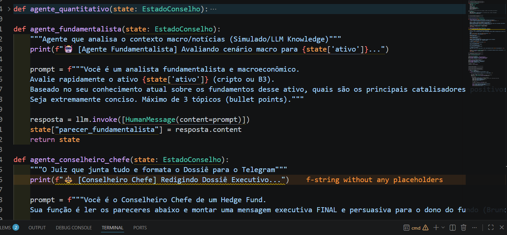
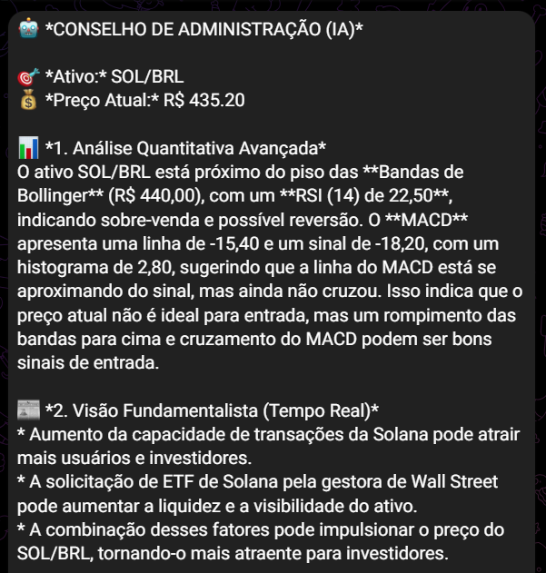
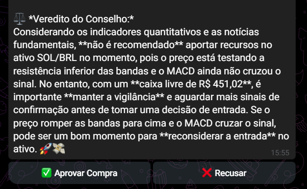
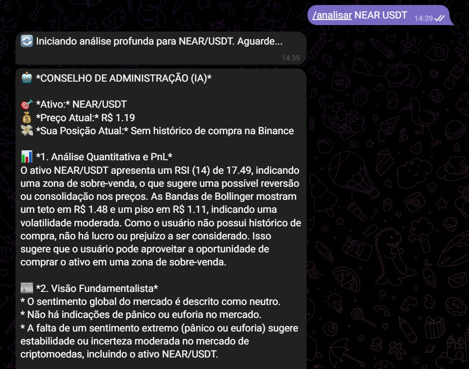
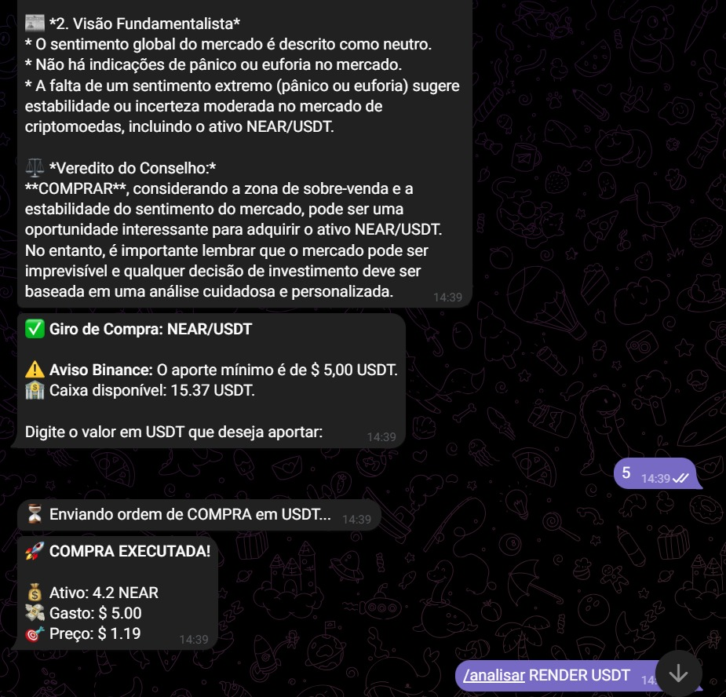
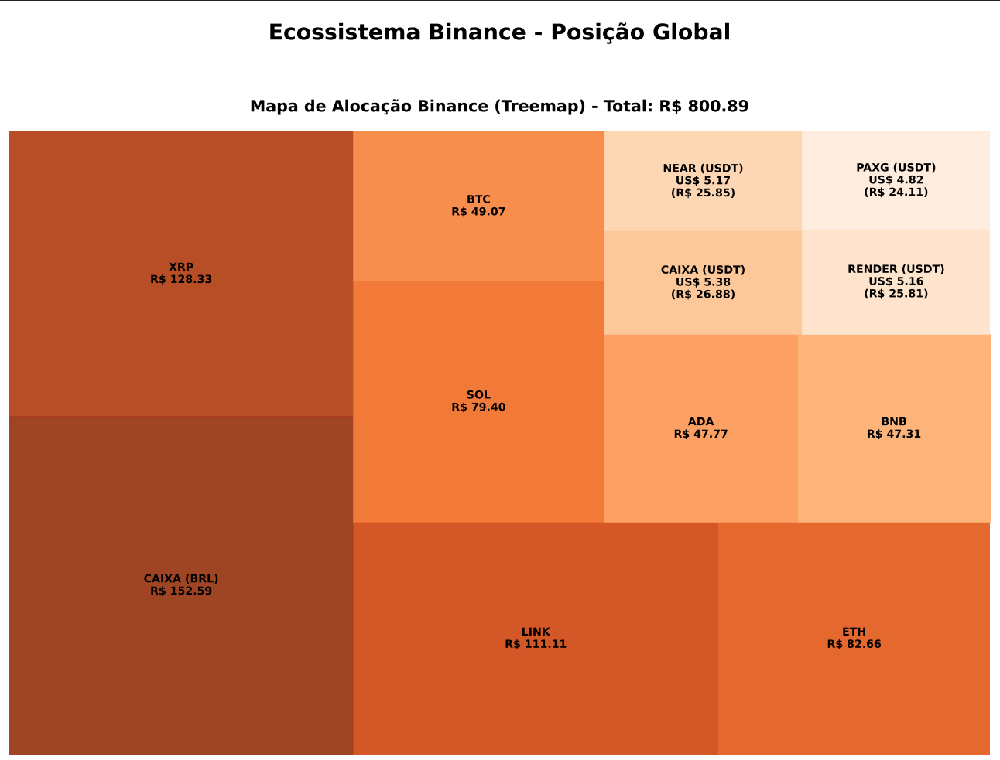
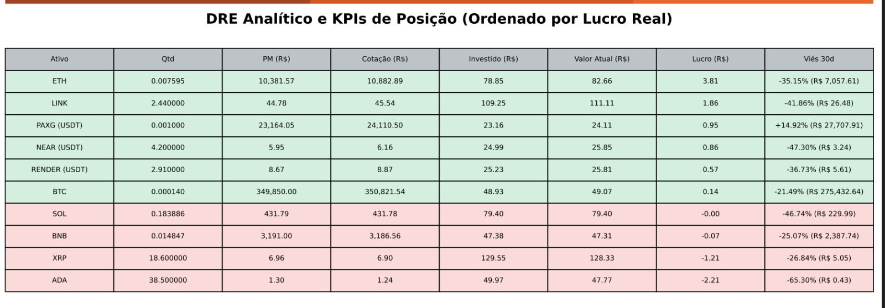
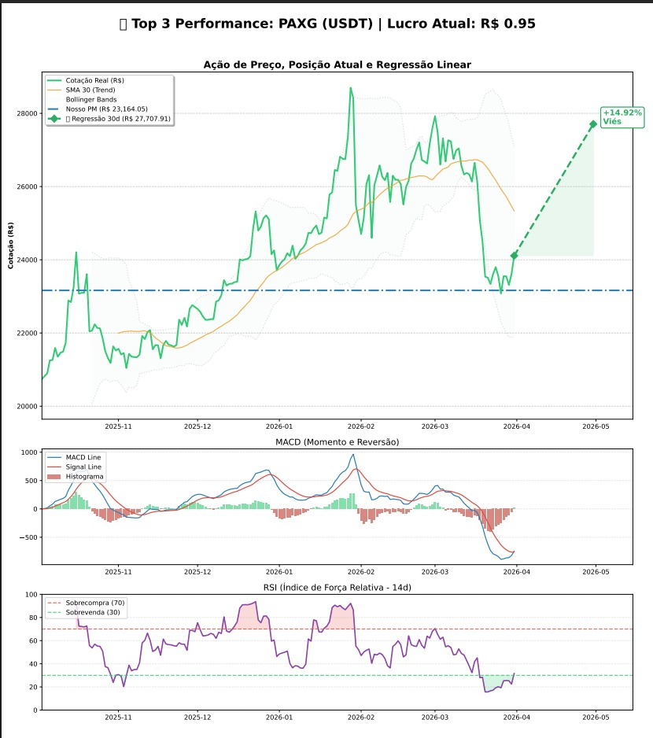
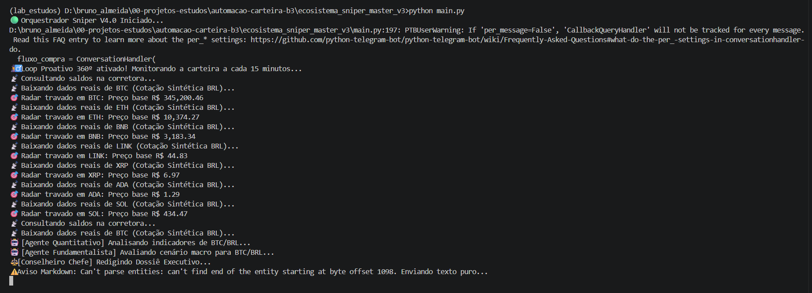
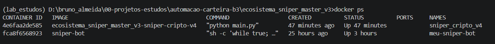

# 🚀 Sniper Cripto V4.1 - Autonomous Quantitative Intelligence & PnL

Sistema avançado de monitoramento e execução de trading quantitativo para o mercado de criptomoedas, desenhado para arquiteturas de *Family Office*. Utiliza orquestração multi-agentes de IA (LangGraph), Processamento de Linguagem Natural ultra-rápido (Groq/Llama 3.3), RAG para leitura de notícias em tempo real e execução algorítmica via CCXT na Binance, com gestão de risco e PnL (Lucro/Prejuízo) automatizados.

## 🛠️ Stack Tecnológica

| Categoria | Tecnologias e Frameworks |
| :--- | :--- |
| **Linguagem & Core** |   |
| **Inteligência Artificial** |   |
| **Mercado & Notícias (RAG)** |    |
| **Interface & DataViz** |   |

## 🧠 Arquitetura de Agentes e Consciência de Bolso (PnL)
O sistema utiliza **LangGraph** para orquestrar um fluxo de decisão com uma inteligência patrimonial única. Os agentes consultam a blockchain/exchange em tempo real para descobrir o **Preço Médio Exato** do usuário. A IA propõe estratégias não apenas baseadas em matemática fria, mas no **Lucro/Prejuízo real da carteira**, recomendando ações de *Take Profit* (Realização de Lucros) em momentos estratégicos.

## 📱 Fluxo de Swing Trade e Tomada de Decisão (Giro Rápido)

O ecossistema é otimizado para capturar volatilidade de curto prazo **(Gatilhos de 3%)**, garantindo total autonomia. A IA aconselha com base no RSI, MACD e Notícias, mas o gestor humano possui um painel de controle absoluto para realizar lucros ou aportar a qualquer momento.

| 1. Dossiê Executivo (PnL) | 2. Painel Autônomo de Giro |
| :---: | :---: |
|  |  |

> **Governança Ativa:** Os botões interativos permitem que o usuário ignore ou acate o "Veredito" da IA, decidindo raspar os lucros de uma operação (Vender) ou fechar a análise imediatamente.

## 🔍 Gatilhos Manuais e Análise sob Demanda (Suporte USDT)
Além do monitoramento autônomo de 15 minutos, o sistema permite invocar a Inteligência Artificial a qualquer momento via Telegram. O pipeline possui suporte nativo a pareamentos em Dólar (USDT), gerando o dossiê quantitativo/fundamentalista e permitindo a execução imediata da ordem diretamente no chat.

| 1. Dossiê IA Sob Demanda (USDT) | 2. Execução Interativa de Compra |
| :---: | :---: |
|  |  |

## 📊 Master Dashboard Institucional e Deep Dive (Automático)
O robô mantém vigilância constante em duas frentes simultâneas:
1. **Loop Proativo (15 min):** Varredura caçando oportunidades sensíveis de *Swing Trade* (3%).
2. **Boletim Executivo (30 min):** O robô gera um **Relatório PDF Multi-page** autônomo, enviado via Telegram, contendo o Treemap de alocação, DRE Analítico ordenado por lucro real e o Deep Dive técnico das Top moedas.

### 1. Visão Global e DRE Analítico (Exposição Cambial)
Consolidação da alocação global suportando portfólios mistos. O **Treemap de Alocação** reflete a exposição real do usuário, isolando graficamente o **Caixa Disponível em BRL e USDT**, além de exibir a dupla conversão (US$ e R$) para ativos pareados em Tether. O DRE possui formatação condicional automática baseada no PnL Real.

| Mapa de Alocação (Multi-Moedas) | DRE Dinâmico (Ordenado por Lucro) |
| :---: | :---: |
|  |  |

### 2. Deep Dive Técnico (Top Performers)
Geração de lâminas detalhadas para os ativos com melhor performance na carteira, destacando Ação de Preço, cruzamento de PM, MACD, RSI e **Regressão Linear Preditiva (30 dias)** em evidência.

| Ação de Preço, Posição Atual e Regressão Linear |
| :---: |
|  |

## 🖥️ Monitoramento 360º (Docker)
Infraestrutura conteinerizada (`PYTHONUNBUFFERED=1`) com blindagem anti-crash.

| Operação via Terminal (VS Code) | Status dos Contêineres |
| :--- | :--- |
|  |  |

---

## 📈 Roadmap de Evolução (Concluído)

- [x] **Comando de Consulta Rápida:** Dashboard instantâneo para cálculo de PnL em tempo real via Telegram.
- [x] **Integração Global (Master Dashboard V4.1):** Unificação dos dados com a criação de gráficos automáticos Multi-page em PDF.
- [x] **DRE Dinâmico e Viés Preditivo:** Implementação de regressão linear para 30 dias com cone de projeção e ordenação de ativos.
- [x] **Exposição Cambial (Caixa Multi-Moeda):** Rastreio autônomo do saldo em carteira (BRL e USDT) integrados à visualização do Treemap de alocação.

---

**Desenvolvido por Bruno Felipe de Almeida** *Especialista em BI & Analytics (USP) | Engenheiro de Dados* 