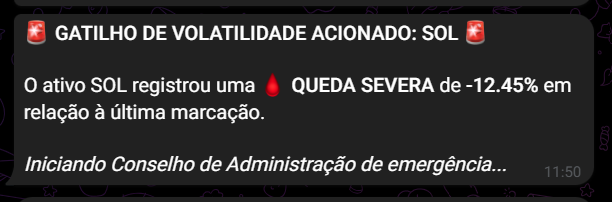
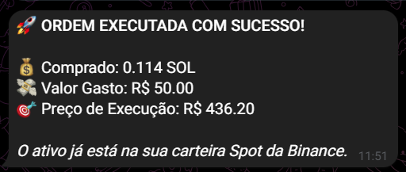

# 🚀 Sniper Cripto V4.0 - Autonomous Quantitative Intelligence

Sistema avançado de monitoramento e execução de trading quantitativo para o mercado de criptomoedas. Utiliza arquitetura multi-agentes de IA (LangGraph), Processamento de Linguagem Natural ultra-rápido (Groq/Llama 3.3), RAG (Retrieval-Augmented Generation) para leitura de notícias em tempo real e execução algorítmica via CCXT na Binance.

## 🛠️ Stack Tecnológica

| Categoria | Tecnologias e Frameworks |
| :--- | :--- |
| **Linguagem & Core** |   |
| **Inteligência Artificial** |   |
| **Mercado & Notícias (RAG)** |    |
| **Interface & Bot** |  |
| **Análise de Dados** |   |

## 🧠 Arquitetura de Agentes (Human-in-the-Loop)
O sistema utiliza **LangGraph** para orquestrar um fluxo de decisão em que agentes especializados colaboram. O diferencial é a trava de segurança humana: a IA propõe com base em matemática fria e notícias globais, mas o gestor dispõe.

## 📱 Fluxo de Operação e Tomada de Decisão

O ecossistema garante total transparência em cada etapa do trade. Abaixo, o fluxo completo desde o monitoramento até a liquidação:

| 1. Gatilho (Volatilidade) | 2. Dossiê IA | 3. Validação Humana | 4. Execução Binance |
| :---: | :---: | :---: | :---: |
|  |  |  |  |

> **Governança:** Na etapa 3, os botões interativos permitem que o usuário aprove ou recuse a operação baseando-se no parecer quantitativo (MACD, Bollinger, RSI) e fundamentalista (Notícias), definindo o valor exato do aporte no ato.

## 🖥️ Logs de Monitoramento 360º
O robô mantém vigilância constante (Dockerized com `PYTHONUNBUFFERED=1` para logs em tempo real) com varreduras proativas e blindadas anti-crash a cada 15 minutos em todos os ativos da carteira.

| Operação via VS Code Terminal | Monitoramento de Contêineres |
| :--- | :--- |
|  |  |

---

## 📈 Roadmap de Evolução (Próximos Passos)

- [ ] **Comando de Consulta Rápida (`/carteira`):** Dashboard instantâneo para cálculo de PnL (Lucro/Prejuízo) em tempo real de todos os ativos da Binance via Telegram.
- [ ] **Integração Global (Master Dashboard V3 + V4):** Unificação dos dados de Renda Variável (B3) e Criptoativos em um único DRE automatizado no Google Sheets, consolidando o patrimônio total da família.
- [ ] **Relatórios Mensais em PDF:** Automação de balanço de performance enviado diretamente pelo bot.

---
**Desenvolvido por Bruno Felipe de Almeida** *Especialista em BI & Analytics (USP) | Engenheiro de Dados* 